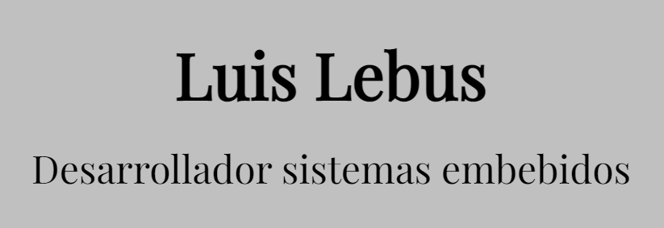

    

## Sobre mí
Soy ingeniero en electrónica, me dedico al desarrollo de sistemas embebidos desde 2017.
 
 
Mis primeras experiencias laborales fueron desarrollando software para productos de agricultura de precisión, como ser sensores, controladores de corte por sección y monitores de siembra. Aquí aprendí a programar de forma extensa en lenguaje C para microcontroladores de la empresa Microchip.
 
 
Durante este tiempo también comencé a estudiar y programar microcontroladores de 32 bits ARM, de modo que mi proyecto final de ingeniería lo realicé sobre la plataforma Tiva-C de Texas Instrument, un procesador ARM Cortex-M4F.
 
 
En los últimos dos años, como autónomo, comencé a desarrollar software y hardware para dispositivos IoT para aplicaciones industriales, utilizando el microcontrolador ESP32 y su librería oficial ESP-IDF. Desarrollé, por ejemplo, un remotizador y controlador para cámaras frigoríficas, también un supervisor de tableros eléctricos industriales. Estos desarrollos ya son productos en venta.
 
 
En cuanto al desarrollo de hardware, tengo amplio conocimiento en el uso de programas como KiCad e Eagle.
